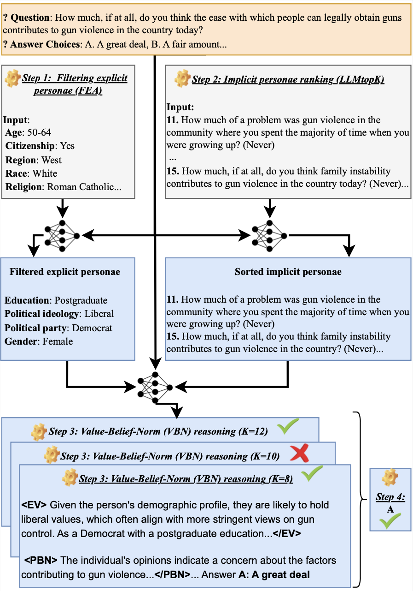

# [COLING 2025] Chain-Of-Opinion (COO)

[](https://aclanthology.org/2025.coling-main.172.pdf)

This repository contains the code for the COLING 2025 paper "[Aligning Large Language Models with Human Opinions through Persona Selection and Value–Belief–Norm Reasoning](https://aclanthology.org/2025.coling-main.172.pdf)". Below is its workflow.



## I. COO Prompting

- **1**: Perform the first two steps of Chain-Of-Opinion (**Filtering explicit personae (FEA)** and **Implicit personae opinions ranking (LLMtop-K)**) via running ```python COO/data/process_data.py```.
- **Step 2**: Perform **Value-Belief-Norm** reasoning via running ```bash run_topX.sh```.
- **Step 3**: Aggregate answers from different values of ```X``` for ```bash run_topX.sh``` to compute the accuracy.

## II. COO Fine-tuning Data

## III. Acknowledgements
If you find our codes are helpful, please ⭐ and cite our paper:

```
@inproceedings{do-etal-2025-aligning,
    title = "Aligning Large Language Models with Human Opinions through Persona Selection and Value{--}Belief{--}Norm Reasoning",
    author = "Do, Xuan Long  and
      Kawaguchi, Kenji  and
      Kan, Min-Yen  and
      Chen, Nancy",
    editor = "Rambow, Owen  and
      Wanner, Leo  and
      Apidianaki, Marianna  and
      Al-Khalifa, Hend  and
      Eugenio, Barbara Di  and
      Schockaert, Steven",
    booktitle = "Proceedings of the 31st International Conference on Computational Linguistics",
    month = jan,
    year = "2025",
    address = "Abu Dhabi, UAE",
    publisher = "Association for Computational Linguistics",
    url = "https://aclanthology.org/2025.coling-main.172/",
    pages = "2526--2547",
    abstract = "Reasoning and predicting human opinions with large language models (LLMs) is essential yet challenging. Current methods employ role-playing with personae but face two major issues: LLMs are sensitive to even a single irrelevant persona, skewing predictions by up to 30{\%}; and LLMs fail to reason strategically over personae. We propose Chain-of-Opinion (COO), a simple four-step solution modeling which and how to reason with personae, inspired by the Value{--}Belief{--}Norm (VBN) theory. COO differentiates between explicit personae (demographics and ideology) and implicit personae (historical opinions), involves: (1) filtering irrelevant attributes from explicit personae; (2) ranking implicit personae into a preferential list for selecting top-k; (3) applying novel VBN reasoning to extract user environmental and personal value, belief, and norm variables for accurate and reliable predictions; and (4) iterating VBN reasoning with progressively larger lists of implicit personae to handle potential persona insufficiency. COO efficiently achieves new state-of-the-art opinion prediction via prompting with only 5 inference calls, improving prior techniques by up to 4{\%}. Notably, fine-tuning LMs with COO`s data results in significantly better opinion-aligned models, by up to 23{\%}."
}
```

We would also like to acknowledge the code base from https://github.com/eujhwang/personalized-llms.
